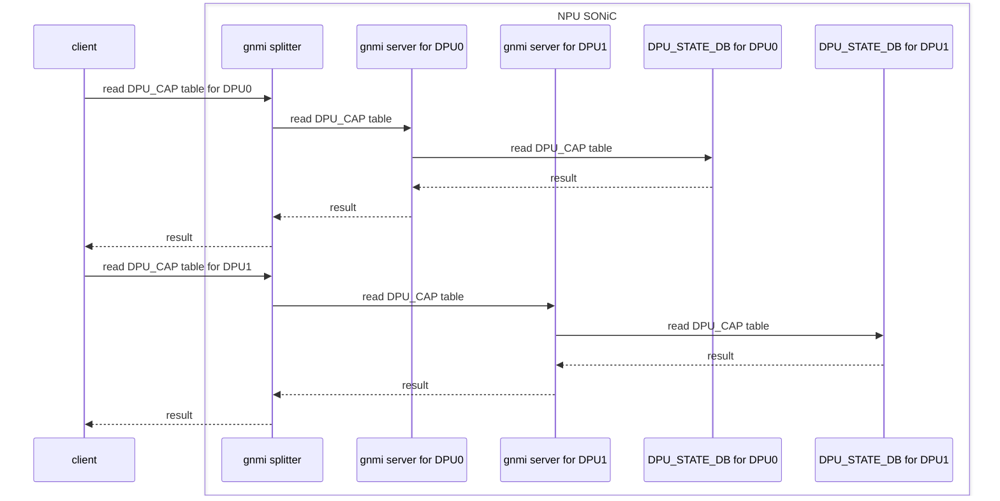

```mermaid
sequenceDiagram
    participant client
    box NPU SONiC
        participant gnmi splitter
        participant gnmi server for DPU0
        participant gnmi server for DPU1
        participant DPU_STATE_DB for DPU0
        participant DPU_STATE_DB for DPU1
    end
    client->>gnmi splitter: read DPU_CAP table for DPU0
    gnmi splitter->>gnmi server for DPU0: read DPU_CAP table
    gnmi server for DPU0->>DPU_STATE_DB for DPU0: read DPU_CAP table
    DPU_STATE_DB for DPU0-->>gnmi server for DPU0: result
    gnmi server for DPU0-->>gnmi splitter: result
    gnmi splitter-->>client: result
    client->>gnmi splitter: read DPU_CAP table for DPU1
    gnmi splitter->>gnmi server for DPU1: read DPU_CAP table
    gnmi server for DPU1->>DPU_STATE_DB for DPU1: read DPU_CAP table
    DPU_STATE_DB for DPU1-->>gnmi server for DPU1: result
    gnmi server for DPU1-->>gnmi splitter: result
    gnmi splitter-->>client: result
```
