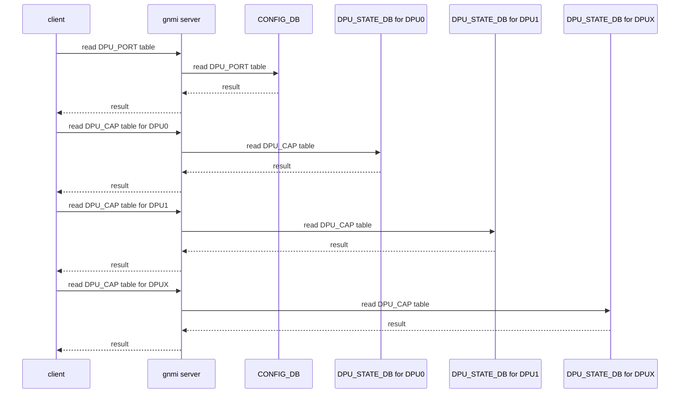

```mermaid
sequenceDiagram
    participant client
    participant gnmi server
    participant CONFIG_DB
    participant DPU_STATE_DB for DPU0
    participant DPU_STATE_DB for DPU1
    participant DPU_STATE_DB for DPUX
    client->>gnmi server: read DPU_PORT table
    gnmi server->>CONFIG_DB: read DPU_PORT table
    CONFIG_DB-->>gnmi server: result
    gnmi server-->>client: result
    client->>gnmi server: read DPU_CAP table for DPU0
    gnmi server->>DPU_STATE_DB for DPU0: read DPU_CAP table
    DPU_STATE_DB for DPU0-->>gnmi server: result
    gnmi server-->>client: result
    client->>gnmi server: read DPU_CAP table for DPU1
    gnmi server->>DPU_STATE_DB for DPU1: read DPU_CAP table
    DPU_STATE_DB for DPU1-->>gnmi server: result
    gnmi server-->>client: result
    client->>gnmi server: read DPU_CAP table for DPUX
    gnmi server->>DPU_STATE_DB for DPUX: read DPU_CAP table
    DPU_STATE_DB for DPUX-->>gnmi server: result
    gnmi server-->>client: result
```
