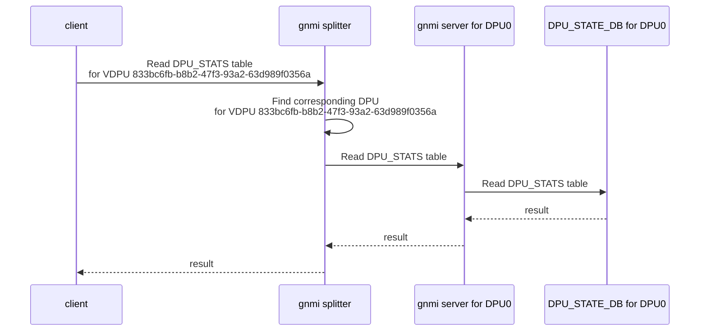

```mermaid
sequenceDiagram
    participant client
    participant gnmi splitter
    participant gnmi server for DPU0
    participant DPU_STATE_DB for DPU0
    client->>gnmi splitter: Read DPU_STATS table<br>for VDPU 833bc6fb-b8b2-47f3-93a2-63d989f0356a
    gnmi splitter->>gnmi splitter: Find corresponding DPU<br> for VDPU 833bc6fb-b8b2-47f3-93a2-63d989f0356a
    gnmi splitter->>gnmi server for DPU0: Read DPU_STATS table
    gnmi server for DPU0->>DPU_STATE_DB for DPU0: Read DPU_STATS table
    DPU_STATE_DB for DPU0-->>gnmi server for DPU0: result
    gnmi server for DPU0-->>gnmi splitter: result
    gnmi splitter-->>client: result
```
