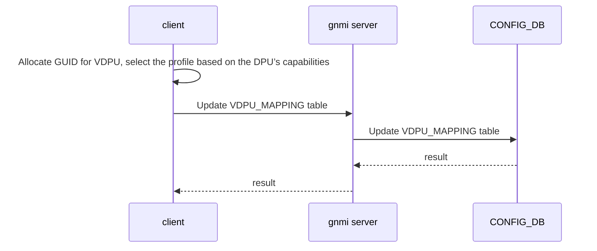

```mermaid
sequenceDiagram
    participant client
    participant gnmi server
    participant CONFIG_DB
    client->>client: Allocate GUID for VDPU, select the profile based on the DPU’s capabilities
    client->>gnmi server: Update VDPU_MAPPING table
    gnmi server->>CONFIG_DB: Update VDPU_MAPPING table
    CONFIG_DB-->>gnmi server: result
    gnmi server-->>client: result
```
