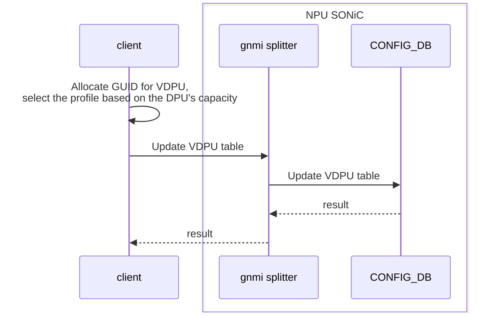

```mermaid
sequenceDiagram
    participant client
    box NPU SONiC
        participant gnmi splitter
        participant CONFIG_DB
    end
    client->>client: Allocate GUID for VDPU,<br>select the profile based on the DPU's capacity
    client->>gnmi splitter: Update VDPU table
    gnmi splitter->>CONFIG_DB: Update VDPU table
    CONFIG_DB-->>gnmi splitter: result
    gnmi splitter-->>client: result
```
