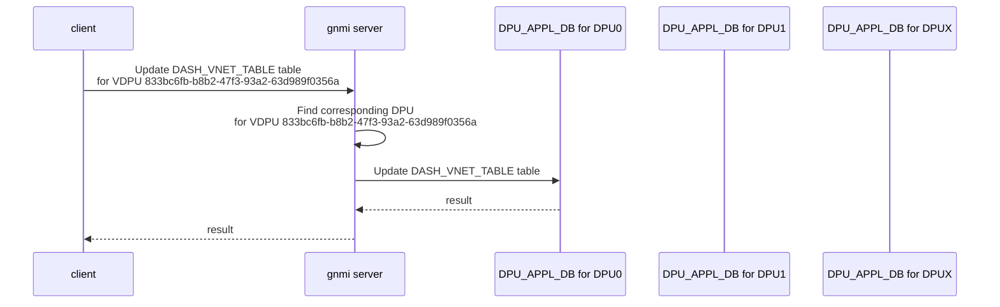

```mermaid
sequenceDiagram
    participant client
    participant gnmi server
    participant DPU_APPL_DB for DPU0
    participant DPU_APPL_DB for DPU1
    participant DPU_APPL_DB for DPUX
    client->>gnmi server: Update DASH_VNET_TABLE table<br>for VDPU 833bc6fb-b8b2-47f3-93a2-63d989f0356a
    gnmi server->>gnmi server: Find corresponding DPU<br> for VDPU 833bc6fb-b8b2-47f3-93a2-63d989f0356a
    gnmi server->>DPU_APPL_DB for DPU0: Update DASH_VNET_TABLE table
    DPU_APPL_DB for DPU0-->>gnmi server: result
    gnmi server-->>client: result
```
