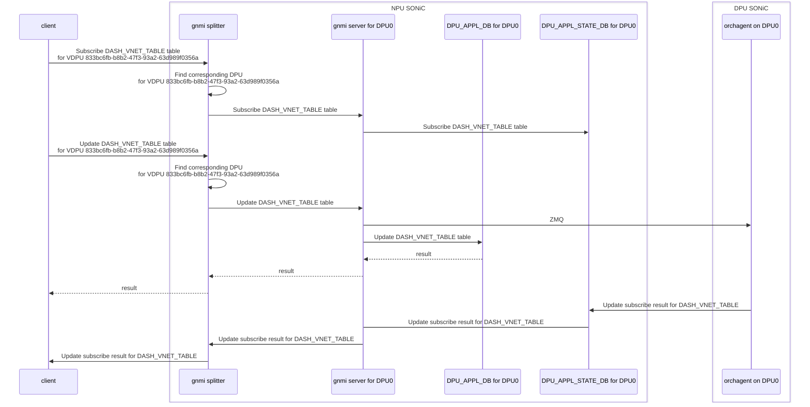

```mermaid
sequenceDiagram
    participant client
    box NPU SONiC
        participant gnmi splitter
        participant gnmi server for DPU0
        participant DPU_APPL_DB for DPU0
        participant DPU_APPL_STATE_DB for DPU0
    end
    box DPU SONiC
        participant orchagent on DPU0
    end
    client->>gnmi splitter: Subscribe DASH_VNET_TABLE table<br>for VDPU 833bc6fb-b8b2-47f3-93a2-63d989f0356a
    gnmi splitter->>gnmi splitter: Find corresponding DPU<br> for VDPU 833bc6fb-b8b2-47f3-93a2-63d989f0356a
    gnmi splitter->>gnmi server for DPU0: Subscribe DASH_VNET_TABLE table
    gnmi server for DPU0->>DPU_APPL_STATE_DB for DPU0: Subscribe DASH_VNET_TABLE table
    client->>gnmi splitter: Update DASH_VNET_TABLE table<br>for VDPU 833bc6fb-b8b2-47f3-93a2-63d989f0356a
    gnmi splitter->>gnmi splitter: Find corresponding DPU<br> for VDPU 833bc6fb-b8b2-47f3-93a2-63d989f0356a
    gnmi splitter->>gnmi server for DPU0: Update DASH_VNET_TABLE table
    gnmi server for DPU0->>orchagent on DPU0: ZMQ
    gnmi server for DPU0->>DPU_APPL_DB for DPU0: Update DASH_VNET_TABLE table
    DPU_APPL_DB for DPU0-->>gnmi server for DPU0: result
    gnmi server for DPU0-->>gnmi splitter: result
    gnmi splitter-->>client: result
    orchagent on DPU0->>DPU_APPL_STATE_DB for DPU0: Update subscribe result for DASH_VNET_TABLE
    DPU_APPL_STATE_DB for DPU0->gnmi server for DPU0: Update subscribe result for DASH_VNET_TABLE
    gnmi server for DPU0->>gnmi splitter: Update subscribe result for DASH_VNET_TABLE
    gnmi splitter->>client: Update subscribe result for DASH_VNET_TABLE
```
