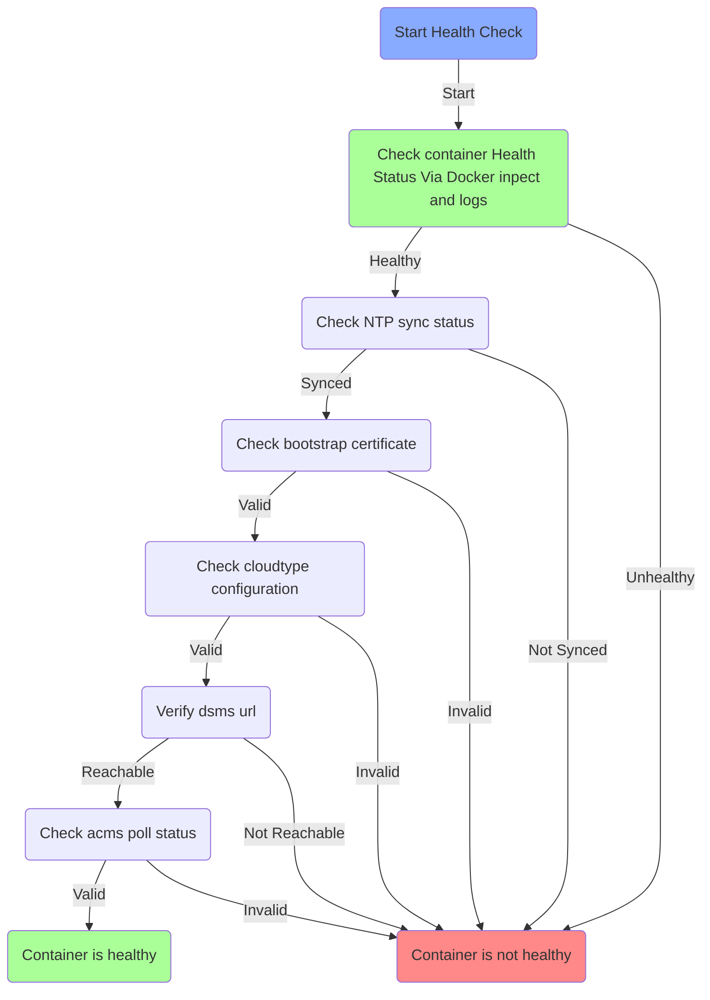

```mermaid
flowchart
    id1(Start Health Check)
    style id1 fill:#8AF
    id2(Check container Health Status Via Docker inpect and logs)
    style id2 fill:#AF9
    id3(Check NTP sync status)
    id4(Check bootstrap certificate)
    id5(Check cloudtype configuration)
    id6(Verify dsms url)
    id7(Check acms poll status)
    id8(Container is healthy)
    style id8 fill:#AF9
    id9(Container is not healthy)
    style id9 fill:#F88

    id1-->|Start|id2
    id2-->|Healthy|id3
    id2-->|Unhealthy|id9
    id3-->|Synced|id4
    id3-->|Not Synced|id9
    id4-->|Valid|id5
    id4-->|Invalid|id9
    id5-->|Valid|id6
    id5-->|Invalid|id9
    id6-->|Reachable|id7
    id6-->|Not Reachable|id9
    id7-->|Valid|id8
    id7-->|Invalid|id9
```
