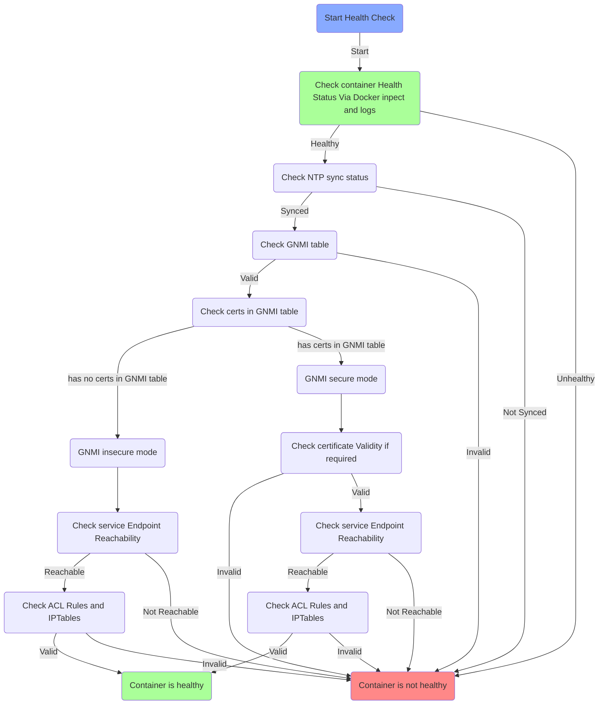

```mermaid
flowchart
    id_health(Start Health Check)
    style id_health fill:#8AF
    id_container(Check container Health Status Via Docker inpect and logs)
    style id_container fill:#AF9
    id_ntp(Check NTP sync status)
    id_gnmi(Check GNMI table)
    id_gnmi_certs(Check certs in GNMI table)
    id_insecure(GNMI insecure mode)
    id_secure(GNMI secure mode)
    id_endpoint1(Check service Endpoint Reachability)
    id_acl1(Check ACL Rules and IPTables)
    id_endpoint2(Check service Endpoint Reachability)
    id_acl2(Check ACL Rules and IPTables)
    id_cert_valid(Check certificate Validity if required)
    id_container_healthy(Container is healthy)
    style id_container_healthy fill:#AF9
    id_container_not_healthy(Container is not healthy)
    style id_container_not_healthy fill:#F88

    id_health-->|Start|id_container
    id_container-->|Healthy|id_ntp
    id_container-->|Unhealthy|id_container_not_healthy
    id_ntp-->|Synced|id_gnmi
    id_ntp-->|Not Synced|id_container_not_healthy
    id_gnmi-->|Valid|id_gnmi_certs
    id_gnmi-->|Invalid|id_container_not_healthy
    id_gnmi_certs-->|has no certs in GNMI table|id_insecure
    id_gnmi_certs-->|has certs in GNMI table|id_secure
    id_secure-->id_cert_valid
    id_cert_valid-->|Invalid|id_container_not_healthy
    id_cert_valid-->|Valid|id_endpoint1
    id_endpoint1-->|Reachable|id_acl1
    id_endpoint1-->|Not Reachable|id_container_not_healthy
    id_acl1-->|Valid|id_container_healthy
    id_acl1-->|Invalid|id_container_not_healthy
    id_insecure-->id_endpoint2
    id_endpoint2-->|Reachable|id_acl2
    id_endpoint2-->|Not Reachable|id_container_not_healthy
    id_acl2-->|Valid|id_container_healthy
    id_acl2-->|Invalid|id_container_not_healthy
```
