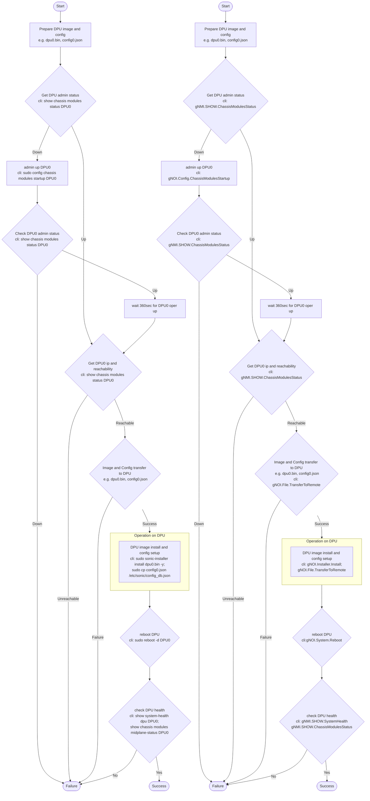

---
config:
  theme: redux
  layout: dagre
---

```mermaid
flowchart TB
 subgraph s1["Operation on DPU"]
        DPUInstall["DPU image install and config setup<br>cli: sudo sonic-installer install dpu0.bin -y;<br>sudo cp config0.json /etc/sonic/config_db.json"]
  end
 subgraph 1s1["Operation on DPU"]
        1DPUInstall["DPU image install and config setup<br>cli: gNOI.Installer.Install;<br>gNOI.File.TransferToRemote"]
  end
    A(["Start"]) --> FilePrepare["Prepare DPU image and config<br>e.g. dpu0.bin, config0.json"]
    FilePrepare --> DPUStatus1{"Get DPU admin status<br>cli: show chassis modules status DPU0"}
    DPUStatus1 -- Up --> C{"Get DPU0 ip and reachability<br>cli: show chassis modules status DPU0"}
    DPUStatus1 -- Down --> D["admin up DPU0<br>cli: sudo config chassis modules startup DPU0"]
    D --> K{"Check DPU0 admin status<br>cli: show chassis modules status DPU0"}
    K -- Up --> L["wait 360sec for DPU0 oper up"]
    K -- Down --> Z(["Failure"])
    L --> C
    C -- Reachable --> FileTransfer{"Image and Config transfer to DPU<br> e.g. dpu0.bin, config0.json"}
    C -- Unreachable --> Z
    FileTransfer -- Success --> s1
    FileTransfer -- Failure --> Z
    s1 --> H{"reboot DPU<br>cli: sudo reboot -d DPU0"}
    H --> I{"check DPU health<br>cli: show system-health dpu DPU0;<br>show chassis modules midplane-status DPU0"}
    I -- Yes --> J(["Success"])
    I -- No --> Z
    1A(["Start"]) --> 1FilePrepare["Prepare DPU image and config<br>e.g. dpu0.bin, config0.json"]
    1FilePrepare --> 1DPUStatus1{"Get DPU admin status<br>cli: gNMI.SHOW.ChassisModulesStatus"}
    1DPUStatus1 -- Up --> 1C{"Get DPU0 ip and reachability<br>cli: gNMI.SHOW.ChassisModulesStatus"}
    1DPUStatus1 -- Down --> 1D["admin up DPU0<br>cli: gNOI.Config.ChassisModulesStartup"]
    1D --> 1K{"Check DPU0 admin status<br>cli: gNMI.SHOW.ChassisModulesStatus"}
    1K -- Up --> 1L["wait 360sec for DPU0 oper up"]
    1K -- Down --> 1Z(["Failure"])
    1L --> 1C
    1C -- Reachable --> 1FileTransfer{"Image and Config transfer to DPU<br> e.g. dpu0.bin, config0.json<br>cli: gNOI.File.TransferToRemote"}
    1C -- Unreachable --> 1Z
    1FileTransfer -- Success --> 1s1
    1FileTransfer -- Failure --> 1Z
    1s1 --> 1H{"reboot DPU<br>cli:gNOI.System.Reboot"}
    1H --> 1I{"check DPU health<br>cli: gNMI.SHOW.SystemHealth<br>gNMI.SHOW.ChassisModulesStatus"}
    1I -- Yes --> 1J(["Success"])
    1I -- No --> 1Z
```
