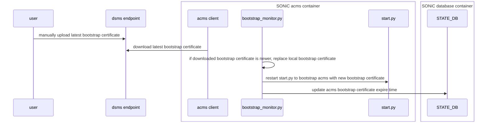

```mermaid
sequenceDiagram
    participant user
    participant dsms endpoint
    box SONiC acms container
        participant acms client
        participant bootstrap_monitor.py
        participant start.py
    end
    box SONiC database container
        participant STATE_DB
    end
    user->>dsms endpoint: manually upload latest bootstrap certificate
    acms client->>dsms endpoint: download latest bootstrap certificate
    bootstrap_monitor.py->>bootstrap_monitor.py: if downloaded bootstrap certificate is newer, replace local bootstrap certificate
    bootstrap_monitor.py->>start.py: restart start.py to bootstrap acms with new bootstrap certificate
    bootstrap_monitor.py->>STATE_DB: update acms bootstrap certificate expire time
```
